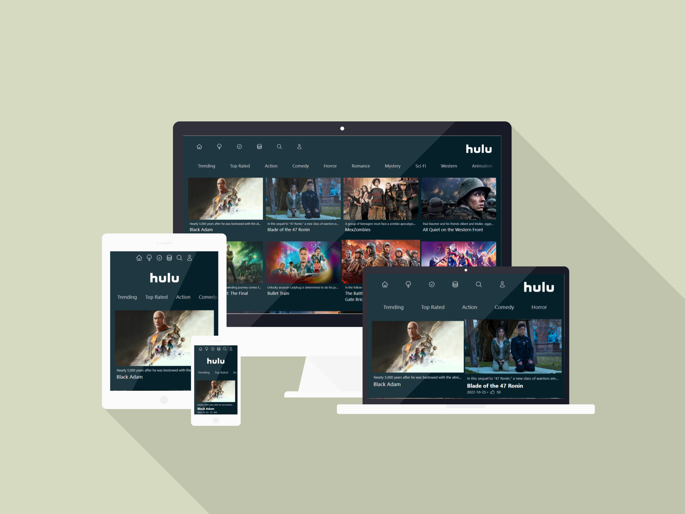

# HULU CLONE NEXT JS PROJECT

## 🔴[LIVE DEMO](https://mh-hulu-clone.vercel.app/)



### API Link:-

- [https://www.themoviedb.org/](https://www.themoviedb.org/)

### 🛠 Technologies used:-

- Next JS
- create-next-app
- Server-side-rendering
- Scrollbar-plugin
- react-flip-move
- TMDB api
- Tailwind CSS
- heroicons
- forward-ref

### Run Locally:-

Clone the project

```bash
  git clone https://github.com/mhhasanmehedi/hulu-clone.git
```

Go to the project directory

```bash
  cd hulu-clone
```

Install dependencies

```bash
  yarn
```

Start the server

```bash
  yarn dev
```
### 🔗 Follow Me:-
[](https://mehedihasan-1.web.app//)
[](https://www.linkedin.com/in/devmehedihasan/)
[](https://twitter.com/mhhasanmehedi)
